# Data-Analysis-of-a-E-Commerce-Store-2019-Sales-Performance

## Introduction 
A data challenge hosted by a vibrant data community involving the analysis of the year sales perfomance of an online gadget store requiring participants to clean, explore, model, and analyze the dataset provided in order to solve the business problems presented

I leveraged my data wrangling skill using SQL to clean, explore, analyze and prepare the dataset for visualization in tableau; while also leveraging my visualization skill in tableau to build an interactive dashboard to allow for hands on relating with the data to aid understanding the data findings

This business analysis not only showcased my analytical skills but also allowed me to connect data intricacies to real-world business challenges, enhancing my proficiency in Business Intelligence.

#### Skills Demonstrated
1. Data wrangling
2. Exploratory Data Analysis using SQL
3. Data Visualization to conjure interactive dashboard to explore relationships between features
4. Business Intelligence
5. Communiating data findings to non-technical stakeholders

Join me on a deep dive into the intricate stages of cleaning, exploring, analyzing, and articulating valuable data insights.

### Dataset Description 
The dataset provided- a bak file- was a backup of a database consisting of 12 tables representing each month of the year.

### Original Data Dictionary
* Order ID  - record of unique transactions
* Product - product sold
* Quantity - quantity of product sold
* Price each - price sold for every transaction
* Order date - date and time for each transaction
* Purchase address - store location for every transaction


### Business Questions / Problems
1. As the Analyst, I’ve been tasked to utilize my analytical and presentation skills to uncover trends and patterns for the 2019 sales year. Generate key sales metrics.
2. The Accountant reported that we made a loss in the months of April, May, June and July as compared to other months. Is this true? What happened? Show monthly sales performance
3. The Assistant manager suggested that we should place more marketing attention on the following cities - Los Angeles, New York, Atlanta, San Francisco and Seattle as they seem to generate more revenue. From the result of your analysis, do you agree with this? Should we proceed with the suggestion? 

### Objectives Derived from Business Challenges:
1. Identify trends and patterns in the 2019 sales data.
2. Generate key metrics to gain a comprehensive understanding of the sales landscape.
3. Investigate reported losses to determine their validity, specifically focusing on the months flagged by the Accountant, and if losses occurred, analyze the root causes.

#### Note:
With the outlined dataset dictionary and the objective of identifying months with losses, a challenge arises. In the traditional business sense, determining losses involves a calculation like [Revenue] - [Cost of Business that month/Business expense]. Unfortunately, this dataset lacks an 'Expense/Cost' feature, leading to the presentation of additional limitations inherent in this dataset.


### Process
i. Data Understanding; Obtain and explore the dataset
ii. Data Cleaning and Preparation for analysis
iii. Identify key features/columns relevant to sales analysis
iv. Calculate and present key sales metrics
v. Share your Insight and make recommendations


### Data Understanding; Obtain and explore Dataset
The dataset was provided as a .bak file (a backup file) So first I had to restore the database using MS SQL (SSMS) 

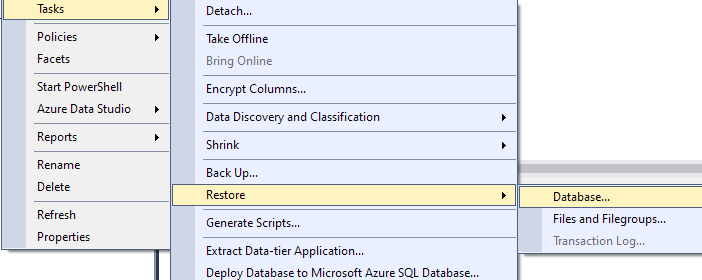
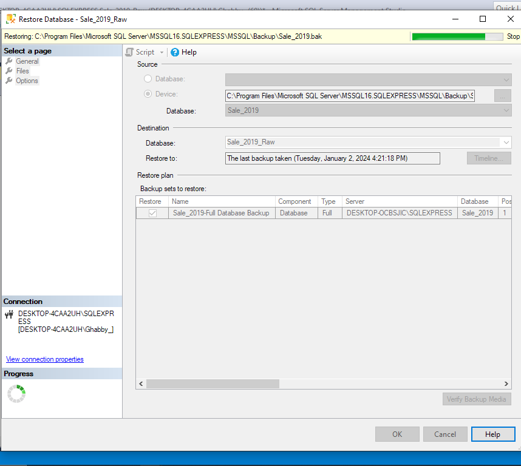
> Process of restoring Database


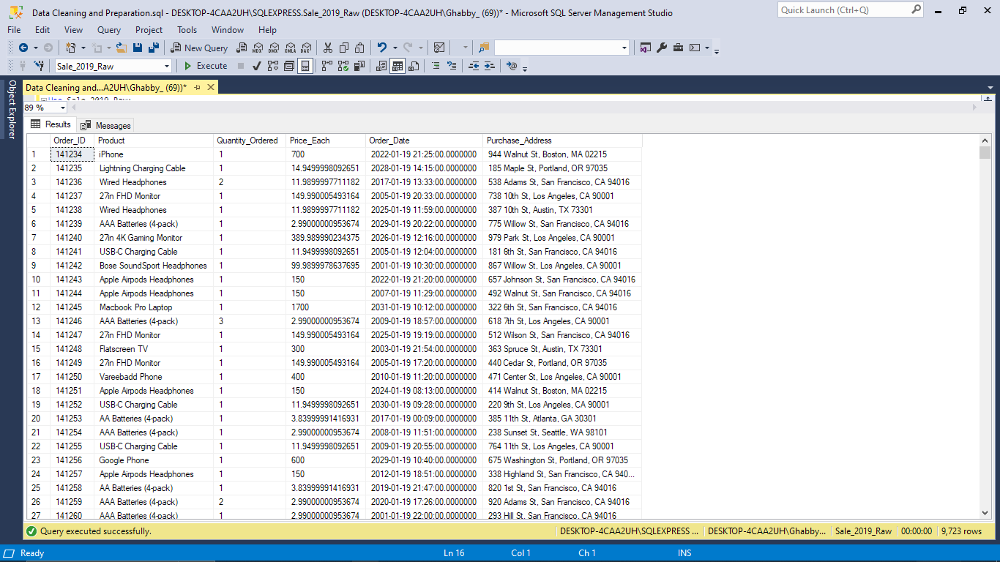
>Preview of the January dataset

### Deductions from raw data:
1. There is a discrepancy in the order date field, with a mismatch of the year and day (e.g.2026–01–19 instead of 2019–01–26). 
Null and empty values. 
2. Decimal figures are not rounded to the nearest decimal places. 
3. The purchase address contains extraneous data, with only the city being relevant (In regards to this analysis)

### DATA CLEANING AND PREPARING
Using the first month as a reference to clean the other tables, I started things off by highlighting the step process I’ll take to clean the dataset
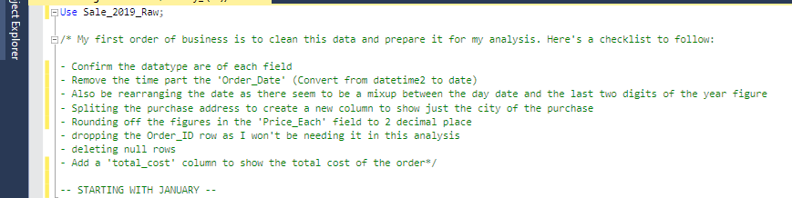

1. Confirming the datatypes of the columns
   
```-- Checking the datatype
EXEC sp_help 'Sales_January_2019';
```
3. Remove the time part the 'Order_Date' (Convert from datetime2 to date)
   
```-- REMOVING THE TIME PART OF THE DATE TIME --
-- First I'll create a NewDateColumn
ALTER TABLE Sales_January_2019
ADD NewDateColumn date;

-- Update the new column with date values from the existing Order_Date column
UPDATE Sales_January_2019
SET NewDateColumn = CAST(Order_Date AS date);

--Drop old 'Order_Date' column
ALTER TABLE Sales_January_2019
DROP COLUMN Order_Date;

--Rename 'NewDateColumn' back to 'Order_Date'
EXEC sp_rename 'Sales_January_2019.NewDateColumn', 'Order_Date', 'COLUMN';

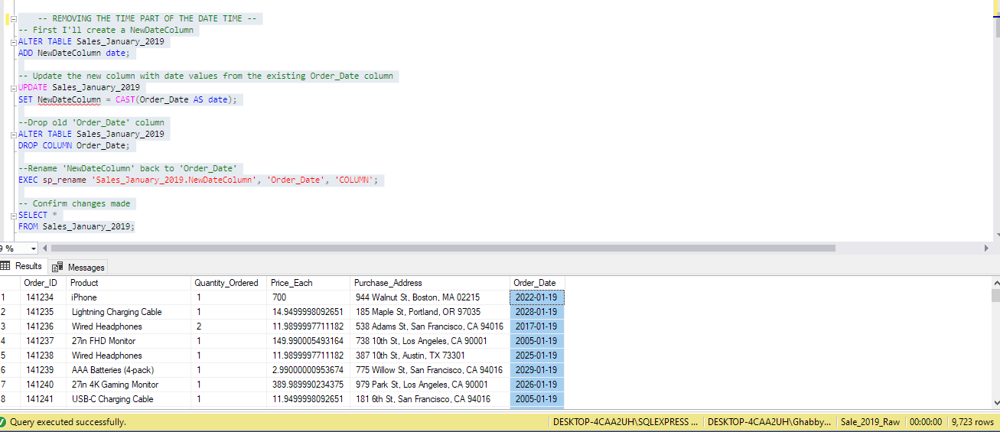
```

3. Rearranging the date format
```	-- REARRANGING DATE FORMAT -- 
ALTER TABLE Sales_January_2019
ADD NewDateColumn DATE;

UPDATE Sales_January_2019
SET NewDateColumn = 
    TRY_CAST(
        SUBSTRING(CONVERT(VARCHAR, Order_Date, 112), 7, 2) + 
        SUBSTRING(CONVERT(VARCHAR, Order_Date, 112), 5, 2) + 
        SUBSTRING(CONVERT(VARCHAR, Order_Date, 112), 3, 2) AS DATE
    );

--Drop old 'Order_Date' column
ALTER TABLE Sales_January_2019
DROP COLUMN Order_Date;

--Rename 'NewDateColumn' back to 'Order_Date
EXEC sp_rename 'Sales_January_2019.NewDateColumn', 'Order_Date', 'COLUMN';
```


4. Rounding off figures in the 'Price_Each' column to 2dp
```
-- ROUNDING OFF THE FIGURES IN THE 'Price_Each' COLUMN TO 2dp --
UPDATE Sales_January_2019
SET Price_Each= ROUND(Price_Each,2);
```
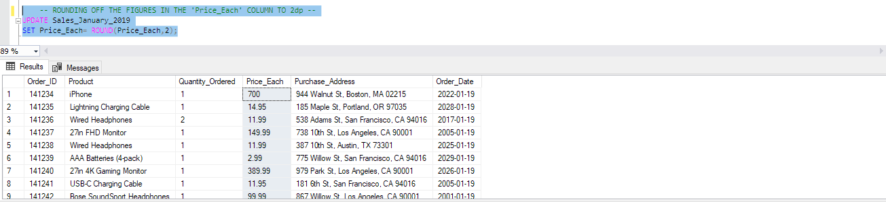

5. Deleting null rows
```
	-- CLEANING NULL ROWS --
SELECT *
FROM Sales_January_2019
WHERE Order_ID IS NULL;

DELETE FROM Sales_January_2019
WHERE Order_ID IS NULL;
```
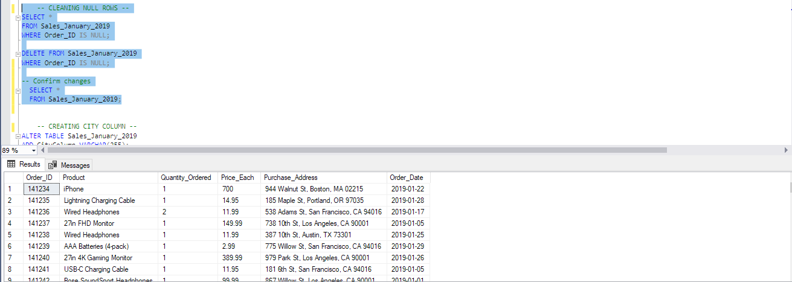

6. Add a 'total_cost' column to show the total cost of the order
```
  -- CREATING A NEW COLUMN TO SHOW TOTAL COST
ALTER TABLE Sales_January_2019
ADD Total_Cost VARCHAR(255);

`UPDATE Sales_January_2019`
`SET Total_Cost = ROUND(Quantity_Ordered * Price_Each, 2);`
```
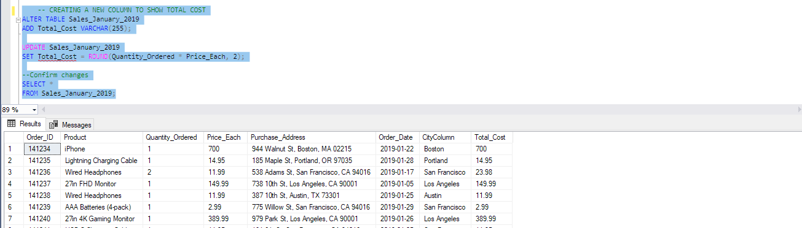


*THEN I REPEATED THE PROCESS FOR THE 11 OTHER MONTHS.*

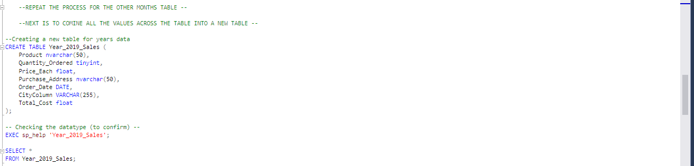

*NEXT WAS TO CREATE A NEW TABLE AND COMBINE ALL MONTHS TABLE AS ONE*

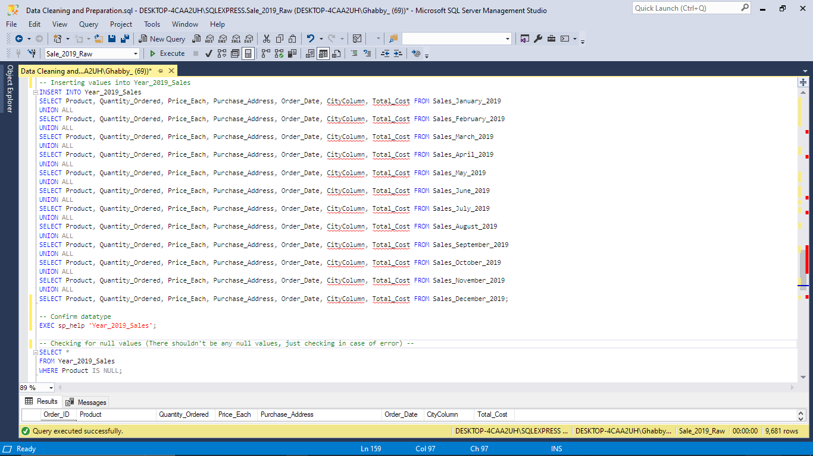


**One last step I then took was to transform the ‘Order_Date’ column to show Short Month values (Jan, Feb, March..)**
```
-- TRANSFORMING [Order_Date] TO SHOW SHORTMONTH VALUES (Jan, Feb, etc.) --

ALTER TABLE Year_2019_Sales
ADD Month VARCHAR(3);

UPDATE Year_2019_Sales
SET Month = 
    CASE 
        WHEN DATEPART(MONTH, Order_Date) = 1 THEN 'Jan'
        WHEN DATEPART(MONTH, Order_Date) = 2 THEN 'Feb'
        WHEN DATEPART(MONTH, Order_Date) = 3 THEN 'Mar'
        WHEN DATEPART(MONTH, Order_Date) = 4 THEN 'Apr'
        WHEN DATEPART(MONTH, Order_Date) = 5 THEN 'May'
        WHEN DATEPART(MONTH, Order_Date) = 6 THEN 'Jun'
        WHEN DATEPART(MONTH, Order_Date) = 7 THEN 'Jul'
        WHEN DATEPART(MONTH, Order_Date) = 8 THEN 'Aug'
        WHEN DATEPART(MONTH, Order_Date) = 9 THEN 'Sep'
        WHEN DATEPART(MONTH, Order_Date) = 10 THEN 'Oct'
        WHEN DATEPART(MONTH, Order_Date) = 11 THEN 'Nov'
        WHEN DATEPART(MONTH, Order_Date) = 12 THEN 'Dec'
    END;
```


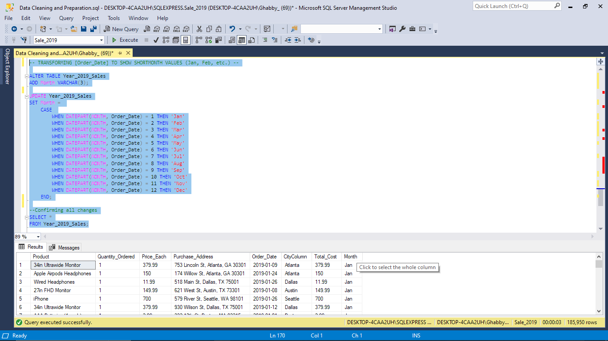
> SQL syntax I used to transform the ‘Order_Date’ column to show Short Month values (Jan, Feb, March..)


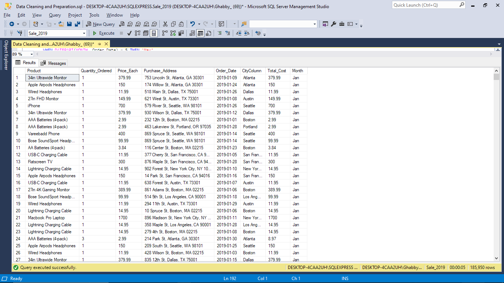
> Cleaned combined table showing a total 185,950 rows

*After, preparing the dataset (cleaning and merging), it’s time to start the analysis phase- generate key metrics*

### The essential metrics to reveal trends and patterns in sales performance and gather insights for making recommendations are:

* Total Revenue

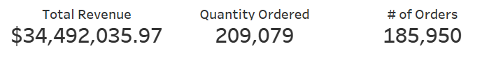
  
* Total Revenue Per Month
  
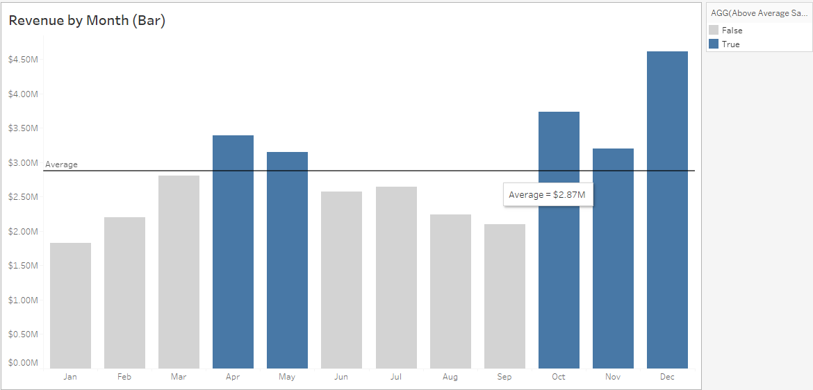
> The revenue by month chart showing  December as the highest performing month, and January the lowest. Plus, we saw a boost in revenue during the second and fourth quarters.

* Total Revenue Per Product

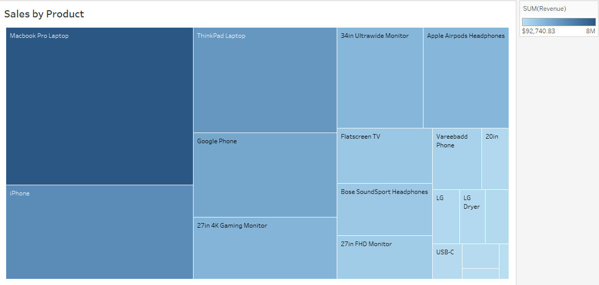
>Macbook Pro Laptop, iPhone, ThinkPad Laptop, and Google Phone are some of the top earners, bringing in the most revenue

* Total Revenue by City

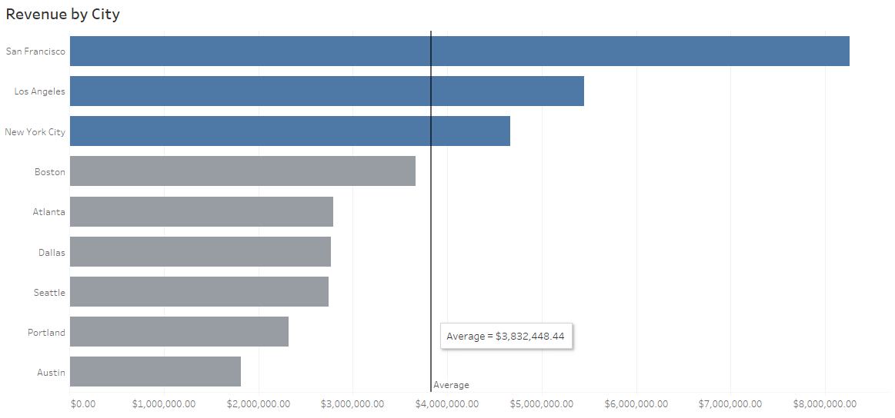
> Stores in Los Angeles, New York City, and San Francisco are the top revenue-generating locations.

* Average Revenue per Month

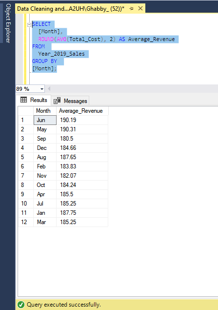
  
* Average Revenue Per Product

  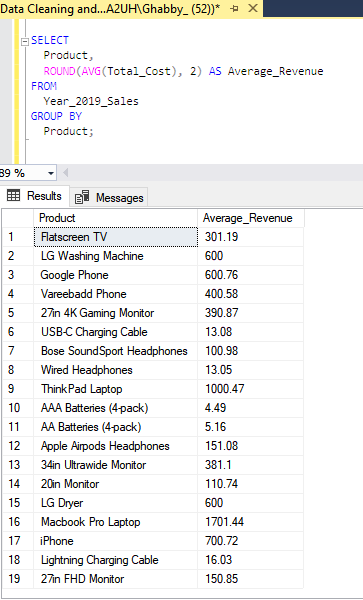

* Total Revenue per Month per Product

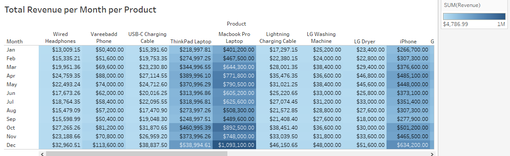
 
* Total Quantity sold per product

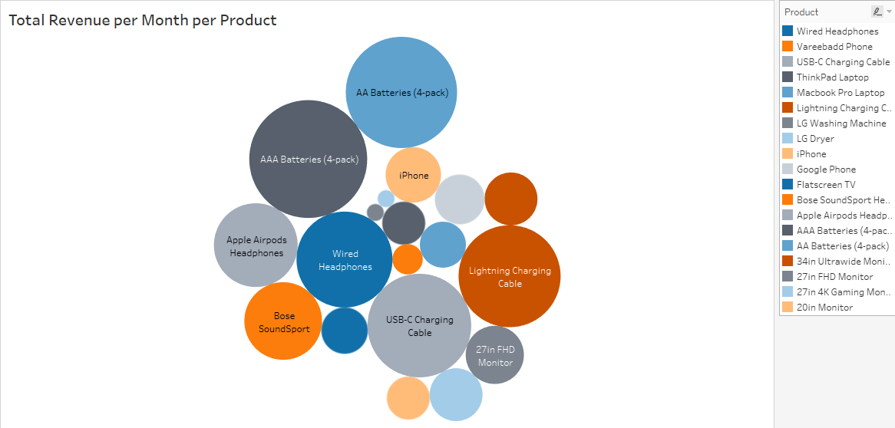
> The AAA Battery pack emerged as the top-selling product


### INSIGHT SUMMARY
* In 2019, the total revenue reached $34,492,035.97.
* The number of orders placed throughout the year was 209,079.
* Sales revenue exhibited a gradual increase until the second quarter, experienced a decline towards the end of the second quarter, and then surged in the fourth quarter, reaching its peak.
* The AAA Battery pack emerged as the top-selling product with 31,017 units sold, generating the least revenue at $92,740.83. In contrast, the Mac Book Pro Laptop, which contributed the highest revenue, outsold the AAA Battery pack by an impressive 8,666%.
* The Macbook Pro Laptop stands out as the product generating the highest revenue.
* December emerged as the highest-performing month, contributing 13.38% to the total revenue.
* The top-performing cities are New York, San Francisco, and Los Angeles.


### Addressing the Business Questions
* “As the Analyst, I’ve been tasked to utilize my analytical and presentation skills to uncover trends and patterns for the 2019 sales year. Generate key sales metrics.”
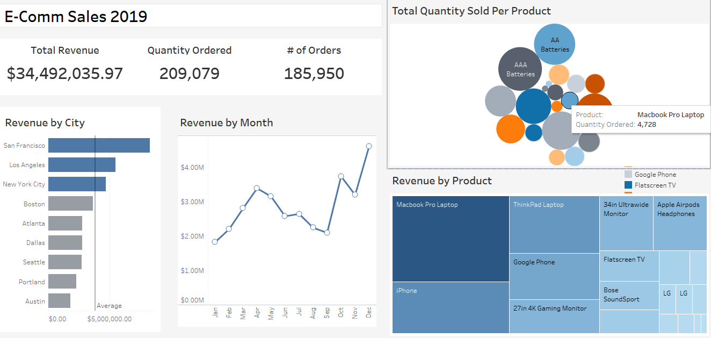
> Dashboard showing Key Sales Metrics

Click [here](https://public.tableau.com/app/profile/gabriel.olanrewaju/viz/E-comAnalysisforYearSales2019/Dashboard?publish=yes) to interact with dashboard


* “The Accountant reported that we made a loss in the months of April, May, June and July as compared to other months. Is this true? What happened? Show monthly sales performance”

> The dataset provided lacks information on business expenses and the cost of operations, hindering the determination of actual losses or profits.
> However, an evaluation based on lower revenue suggests that, except for April, all the months highlighted by the Accountant did experience lower revenue compared to the preceding months. 

3. “The Assistant manager suggested that we should place more marketing attention on the following cities - Los Angeles, New York, Atlanta, San Francisco and Seattle as they seem to generate more revenue. From the result of your analysis, do you agree with this? Should we proceed with the suggestion?”

> Based on the dataset analysis, we can evaluate the Assistant Manager's suggestion. Out of the mentioned cities, only three—Los Angeles, New York, and San Francisco—demonstrate revenue figures exceeding the > average. Therefore, it is advisable to proceed with the marketing emphasis on these cities.

### Recommendations
* Optimize Product Portfolio:
   - Stakeholders should consider evaluating and possibly expanding the product range to capitalize on high-performing products like the Macbook Pro Laptop.
   - Assess the market potential for the AAA Battery pack, which is a top-selling product with lower revenue. There might be opportunities to enhance its pricing or explore complementary products.
   - Consider the introduction of complementary products to enhance the overall purchase value and revenue, particularly for top-selling products that generate relatively low revenue. For example, in the case of AAA batteries, one could explore the addition of supplementary products such as battery chargers.

* Seasonal Inventory Management:
   - Plan for inventory adjustments based on the observed seasonal fluctuations. Understanding the sales patterns can help in optimizing stock levels and preventing overstocking or stockouts; take for instance the surge in sales in December which can be attributed to the festivities and anticipation of the new year 

* Marketing Strategies:
   - Focus on targeted promotions during periods of slower sales and capitalize on the peak quarters.
   - Leverage the popularity of the Macbook Pro Laptop in marketing campaigns, and explore strategies to boost sales of other high-margin products.

* City-Specific Campaigns:
   - Invest more in marketing and sales efforts in the best-performing cities—New York, San Francisco, and Los Angeles as suggested by the Accountant too. Tailor promotions and campaigns to the preferences and behaviors of customers in these areas.

* Year-End Promotions:
   - Considering December's outstanding performance, strategize and implement special promotions, discounts, or exclusive deals to maximize revenue during the holiday season.

 * Pricing Optimization:
   - Reevaluate the pricing strategy for products generating lower revenue but high sales volume. Adjusting prices may enhance overall profitability.

### Dataset/ Project Constraints:
1. Absence of Business Context:
   - The dataset lacks information that would shed light on the nature and intricacies of the business under analysis, limiting a holistic understanding of its operations and context.
2. Incomplete Financial Insight:
- The absence of data on business expenses throughout the year impedes the ability to accurately assess losses, profits, and the overall financial health of the business.
3. Lack of Product Cost Information:
 The dataset does not provide insights into the cost prices of the products, hindering the capacity to determine the actual profit margins and identify which products contribute the most to overall profitability.
4. Limited Customer and Product Details:
- No data on customer demographics, specific product attributes, or a breakdown of costs restricts the depth of analysis, preventing a nuanced understanding of customer behavior and product performance hence limiting a more comprehensive analysis.


